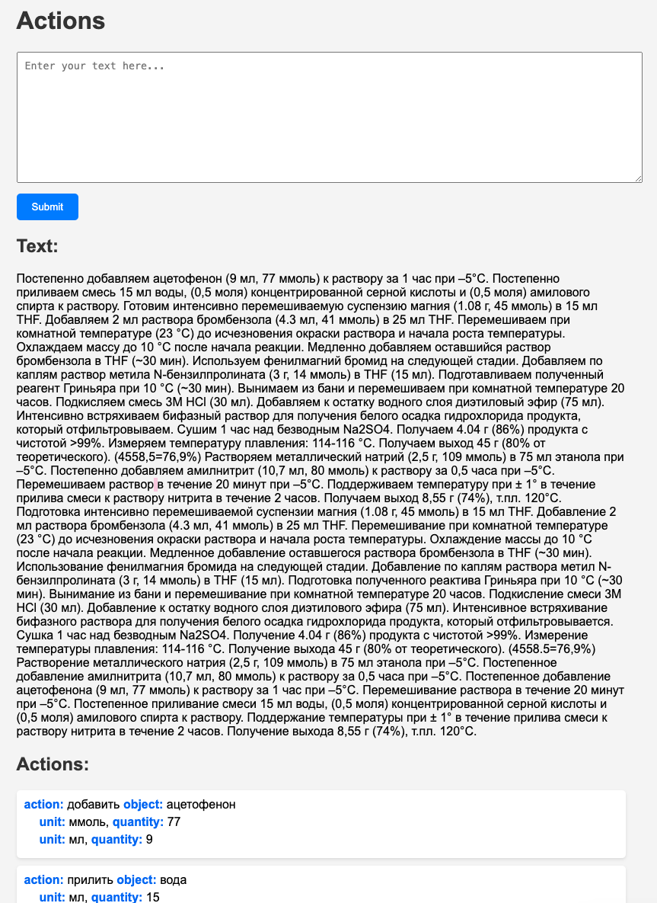
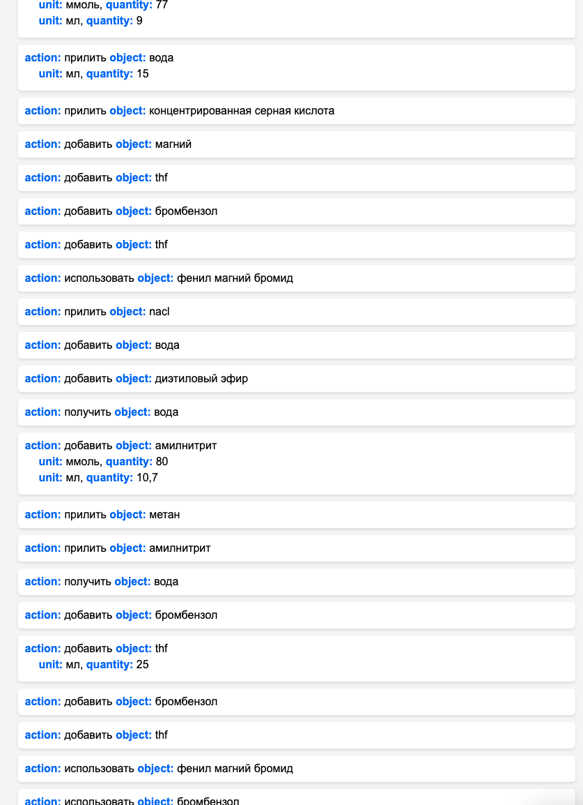

## Зависимости
```bash
pip install Flask
pip install -U pip setuptools wheel
pip install -U spacy
python -m spacy download ru_core_news_sm
```

## Демо



## Что можно улучшить?
- Сопоставление слов. Параметр `threshold` не очень честно работает
для слов, которые при склонении сильно трансформируются.
- То есть поиск реактивов вместо использования базы знаний сделать с использованием
именованных сущностей. Это решит проблемы вроде следующей:
    > Токен `концентрированной` должен ассоциироваться с -> `концентрированная серная кислота`, 
    > однако этого не происходит и сущность не учитывается.
- Можно компенсировать с использованием `раскрутки вниз` - рассмотрения всех связанных слов.
Например `фенил -> [child] магний -> [child] бромид`.
- Добавить обработку конъюнкций `добавляем реактив1, реактив2`.
- Связь `добавляем реактив (9 мл)` распознается как `parataxis`. 
Исследовать, насколько это уместно.
- Процессинг кореферентных выражений