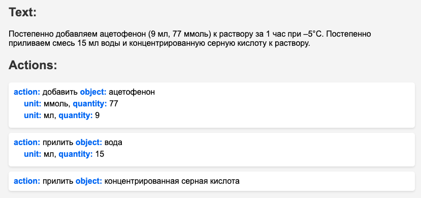

## Задача для MVP
Извлекать из текста информацию о совершении количественных действий над реактивом (стало больше/меньше).
## Теоретический анализ
Задачу можно решить двумя способами: генерация структур по тексту или с использованием обычных методов обработки естественного языка, таких как выделение именованных сущностей и их анализ. В данной работе используется второй подход. Альтернативный способ предполагает использование модели, основанной на трансформерах (проверено, GPT-3.5 отлично справляется с этой задачей и может быть рассмотрена в качестве альтернативы).

Хотя не существует публично доступных исследований, решающих именно эту задачу, существует программное обеспечение, такое как chemdataextractor и [chemdataextractor2](https://github.com/CambridgeMolecularEngineering/chemdataextractor2.git), извлекающее информацию о реактивах из текста. Однако оно не применимо в данной проблеме, так как сосредоточено на анализе характеристик реактивов, а не на действиях, выполняемых с ними.
## Результат
Реализованное ПО способно извлекать события, произошедшие с реактивом в ходе исследований, а также находить количественные характеристики, фигурирующие в этих действиях.


## Описание экспериментов
- Проводилась серия экспериментов с текстами, в связи с чем были сформированы задачи на дальнейшее развитие проекта (см. [`README.md` > `Что можно улучшить?`](https://github.com/xlab-it/usages-detector?tab=readme-ov-file#%D1%87%D1%82%D0%BE-%D0%BC%D0%BE%D0%B6%D0%BD%D0%BE-%D1%83%D0%BB%D1%83%D1%87%D1%88%D0%B8%D1%82%D1%8C).
- Исследовались ошибки в распознавании. Была выявлена необходимость дообучить модель. В этом поможет анализ журналов, которые будут собираться в рамках системы, для которой создан данный проект.
- Для формирования тестовой выборки использовался подготовленный вручную текст (отчищенный от rtf, markdown, \*TeX форматирования). Однако неподготовленный текст также хорошо проходит тестирование, так как алгоритм допускает погрешность. Для улучшения `hit`-показателей (удачных распознаваний)  необходимо добавить слой обработки данных, нормализующий текст.
- Проводились эксперименты с GPT-3.5, GPT-4. Обе модели показали отличный результат в распознавании всех кейсов из тестировочной выборки (100% нахождение действий над реактивами и преобразование в требуемый формат, учет мета-информации: количественные характеристики действия, составление `summary`-комментария о контексте действий)
## Алгоритм
**1. Токенизация предложений**
Текст разбивается на предложения с использованием токенизатора - предобученная на русском языке [модель](https://github.com/Mottl/ru_punkt.git)

```python
def tokenize_sentences(text):
    with open('tokenizers/punctuation_marks.pickle', 'rb') as f:
        model = pickle.load(f)
        sentences = model.tokenize(text)
        return sentences
```

**2. Поиск реактивов**
Для каждого предложения выполняется поиск реактивов с помощью метода `find_chemicals` класса `ChemicalFinder`. Если слово не точно соответствует реактиву, то применяется [сопоставление гештальт-образцов](https://en.wikipedia.org/wiki/Gestalt_pattern_matching) . Допустимая погрешность задается параметром `threshold`.

```python
def find_chemicals(self, text):
    doc = self.nlp(text)
    found = []
    for token in doc:
        if token.text.lower() in self.context.chemicals:
            found.append(token)
        else:
            label, ratio = self.find_most_similar_token(token)
            if ratio > self.context.threshold:
                found.append(token)
    return found
```

**3. Идентификация действий**
Для каждого найденного реактива выполняется поиск главного слова в предложении, которое является сказуемым или состоит с реактивом в связи `nsubj`. Если корень найден, выполняется поиск количественных характеристик для реактива.

```python
def extract_actions(text: str, chemicals: list[str], usage_actions: list[str], threshold: float) -> list[dict]:
    # ...
    for sentence in sentences:
        dependencies = []
        find_chemicals = finder.find_chemicals(sentence)

        for chemical in find_chemicals:
            head = find_head(chemical)
            if head.pos_ in ["NOUN", "VERB"]:
                quantities = find_quantities(chemical)
                dependencies.append(Dependency(
                    action=(head.lemma_, head.pos_),
                    obj=chemical,
                    meta=quantities
                ))
    # ...
```

**4. Нормализация меток**
Для каждого найденного действия и реактива выполняется нормализация меток с использованием методов `normalize_action_label` и `normalize_chemical_label`.
Нормализация в данном случае шире лемматизации, так как помимо падежа, и других склоняющих характеристик, приводится и часть речи (к примеру, `добавление` -> `добавить`)

```python
def normalize_chemical_label(self, chemical_label: str):
    label = chemical_label.lower()
    label, ratio = self.find_most_similar(label, self.context.chemicals)
    return label

def normalize_action_label(self, action_label: str):
    label = action_label.lower()
    label, ratio = self.find_most_similar(label, self.context.usage_actions)
    return label
```

## Используемые библиотеки
**SpaCy** - библиотека для обработки естественного языка, написана на Python и Cython. Предоставляет простой и эффективный API для выполнения множества задач NLP, таких как токенизация, лемматизация, выделение именованных сущностей и тд. В данном контексте используется для токенизации текста, синтаксического, морфологического анализа.

**difflib** - модуль стандартной библиотеки Python, который предоставляет классы и функции для сравнения последовательностей. Может использоваться для сравнения информации в файлах, включая контекстные и объединенные отличия. В данном контексте используется для нахождения именованных сущностей - реактивов.

**pickle** - модуль стандартной библиотеки Python, который предоставляет возможность сериализации и десериализации объектов Python. Используется для токенизации предложений, загружая предобученный токенизатор.
